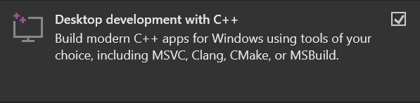
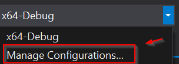
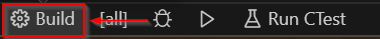

[[Page Maintainers | Best Practices to Edit and Compile Pytorch Source Code On Windows]]:: @mszhanyi , @ozanMSFT

* [Goals](#Goals)
* [Prerequisites](#Prerequisites)
	* [(Optional) CUDA](#Optional-Cuda)
	* [(Optional) Other Tools](#Optional-Other-Tools)
	* [MSVC - Build Tools](#MSVC--Build-Tools)
	* [Ninja](#Ninja)
	* [Python](#Python)
	* [Source Code](#Source-Code)
	* [Installing requirements.txt](#Installing-requirementstxt)
* [Visual Studio 2022/2019 Guide](#Visual-Studio-20222019-Guide)
	* [Open Project](#Open-Project)
	* [Build Project](#Build-Project)
	* [Modify Source and Rebuild](#Modify-Source-and-Rebuild)
	* [Run Project](#Run-Project)
* [Visual Studio Code Guide](#visual-studio-code-guide)
	* [Open Project](#OpenProject-1)
	* [Build Project](#Build-Project-1)
	* [Modify Source and Rebuild](#Modify-Source-and-Rebuild-1)
	* [Run Project](#Run-Project-1)
* [Final Notes](#Final-Notes)

## Goals
In this guide, we'll cover some best practices to work with PyTorch C++ Source code on Windows.

> Note: In this guide, we'll only cover `libtorch` compilation as an example. As a general base guide; you can also refer the page [building libtorch](https://github.com/pytorch/pytorch/blob/main/docs/libtorch.rst).

## Prerequisites

### (Optional) CUDA

Installing `CUDA` is not mandatory for compilation, but you may want to install it depending on your needs.

Please take a look on this page for the supported CUDA versions and installation:
https://github.com/pytorch/pytorch#from-source

### (Optional) Other Tools

Although `MKL`, `cuDNN`, `oneAPI`, `ONNX Runtime` and some other dependencies may not be necessary for this guide's scope, you may want to install them depending on your needs for other compilation scenarios.

### MSVC - Build Tools

You need to have `Microsoft Visual C++ (MSVC) compiler toolset` on your system.

With `Visual Studio Installer`, you need to install `Desktop Development with C++` workload.

**Option 1:** If you already have `Visual Studio 2022` or `Visual Studio 2019`

You can open `Visual Studio Installer` by searching from Start Menu and click `Modify` for your relevant Visual Studio installment.


Then you can check if `Desktop Development with C++` workload is **checked**.



**Option 2:** If you're planning to use `Visual Studio Code`

You can install `Build Tools for Visual Studio` from following URL without installing full Visual Studio IDE.

https://visualstudio.microsoft.com/downloads/#build-tools-for-visual-studio-2022

After installation, you can open `Visual Studio Installer` and install `Desktop Development with C++` workload.


> Note: Please check installation path, we'll need it when defining PATH.

### Ninja

**Option 1:** Use `Ninja` executable from `Desktop Development with C++` workload

If you followed [MSVC - Build Tools](#MSVC--Build-Tools), `Ninja` should be already under build tools installation folder.

If you've `Visual Studio 2022` or `Visual Studio 2019`: </br> `Ninja` should be already under your Visual Studio folder:
> `{VSPATH}\Common7\IDE\CommonExtensions\Microsoft\CMake\Ninja\ninja.exe`

If you've `Visual Studio Code`: </br> `Ninja` should be already under installation folder which you've specified while installing `Desktop Development with C++` workload.
> `{BUILDTOOLSPATH\Common7\IDE\CommonExtensions\Microsoft\CMake\Ninja\ninja.exe`

**Option 2:** Use `Ninja` from GitHub Release

Download `Ninja` separately and add it to `PATH`.

https://github.com/ninja-build/ninja/releases

### Python

You need to install `Python` to your system.

https://www.python.org/downloads/windows/

> Note: This guide is tested with the latest stable Python version "3.12" (November 2023)

### Source Code

Source code should be fetched as instructed in the main page. [Get the PyTorch Source](https://github.com/pytorch/pytorch#get-the-pytorch-source)

### Installing requirements.txt

Install `requirements.txt` from root folder.

```
pip install -r requirements.txt
```

## Visual Studio 2022/2019 Guide

### Open Project

You can open `PyTorch` project with `Open a local folder` option.


### Build Project

After the opening source code folder, Visual Studio should automatically detect `CMake` type project.

1. Click `Manage Configurations...` to open `CMake Settings` window.

   

2. Click `Edit JSON` shourtcut to edit parameters of `CMake`.

   

3. Copy and paste following example JSON content into `CMakeSettings.json` file and **save it** after **replacing** placeholders accordingly. Especially, please do not forget to replace `{{PYTHON_ROOT}}` parameter as suggested below.

   > Note: Please replace `{{PYTHON_ROOT}}` with actual root folder of `Python`. </br> You can find it with `cmd` command `where python`

   > Note: Settings and parameters may change depending on your needs. Currently, we're focusing for an example `libtorch` build.

   > Note: For this example, following parameters are different than default parameters `installRoot`, `cmakeCommandArgs` and `variables` section

   ```
   {
      "configurations": [
         {
            "name": "x64-Debug",
            "generator": "Ninja",
            "configurationType": "Debug",
            "inheritEnvironments": [ "msvc_x64_x64" ],
            "buildRoot": "${projectDir}\\out\\build\\${name}",
            "installRoot": "${projectDir}\\torch",
            "cmakeCommandArgs": "-DVS_STARTUP_PROJECT=Torch",
            "ctestCommandArgs": "",
            "variables": [
               {
                  "name": "BUILD_PYTHON",
                  "value": "False",
                  "type": "BOOL"
               },
               {
                  "name": "BUILD_TEST",
                  "value": "True",
                  "type": "BOOL"
               },
               {
                  "name": "CMAKE_PREFIX_PATH",
                  "value": "{{PYTHON_ROOT}}\\Lib\\site-packages",
                  "type": "PATH"
               },
               {
                  "name": "NUMPY_INCLUDE_DIR",
                  "value": "{{PYTHON_ROOT}}\\Lib\\site-packages\\numpy\\core\\include",
                  "type": "PATH"
               },
               {
                  "name": "PYTHON_EXECUTABLE",
                  "value": "{{PYTHON_ROOT}}\\python.exe",
                  "type": "PATH"
               },
               {
                  "name": "PYTHON_INCLUDE_DIR",
                  "value": "{{PYTHON_ROOT}}\\Include",
                  "type": "PATH"
               },
               {
                  "name": "USE_NUMPY",
                  "value": "True",
                  "type": "BOOL"
               }
            ]
         }
      ]
   }
   ```

4. After saving the file, `CMake` output should automatically start to prepare configuration, wait for a while and you should see `CMake generation finished` message on the bottom. 

   > Note: If you're seeing an error, please check parameters before continue.

   

5. Now, navigate `Build -> Build All` menu to start build. Build result will be under `out\build\x64-Debug` folder. 

   > Note: First time build might take some time depending on build machine's specifications.

   

### Modify Source and Rebuild

1. As an example change; let's open `test\cpp\api\nn_utils.cpp` file and search for `TEST_F(NNUtilsTest, ConvertParameters)` test.</br> Let's add a `printf` in this test.

   

2. Build project again by navigating `Build -> Build All`.

   > Note: Following builds after the first time build should take only a few minutes.

   

### Run Project

1. Let's setup `Debug Target` as `test_api.exe (bin\test_api.exe)` for our project's scope.

   > Note: You can hide all unnecessary targets for clean view.

   

   

2. Let's also modify `Debug and Launch Settings for test_api` to specifiy additional parameters for debugging, this will open `launch.vs.json` file.

   

3. For simplicity, let's add this filter as an argument to run only our modified test and save `launch.vs.json` file.

   ```
   "args": [ "--gtest_filter=NNUtilsTest.ConvertParameters" ]
   ```

   

4. Run project and see the result.

   

   

## Visual Studio Code Guide

### Open Project

1. Open `PyTorch` folder with `Visual Studio Code`.

2. Install [CMake Tools](https://marketplace.visualstudio.com/items?itemName=ms-vscode.cmake-tools) extension by Microsoft.

### Build Project

1. Navigate `.vscode` folder from root and create `settings.json` file. Copy following JSON content and **save it** after **replacing** placeholders accordingly. Especially, please do not forget to replace `{{PYTHON_ROOT}}` parameter as suggested below.

   

   > Note: Please replace `{{PYTHON_ROOT}}` with actual root folder of `Python`. </br> You can find it with `cmd` command `where python`

   > Note: Settings and parameters may change depending on your needs. Currently, we're focusing for an example `libtorch` build.

   ```
   {
      "cmake.generator": "Ninja",
      "cmake.configureSettings":{
         "BUILD_PYTHON":"False",
         "BUILD_TEST":"True",
         "CMAKE_PREFIX_PATH":"{{PYTHON_ROOT}}\\Lib\\site-packages",
         "NUMPY_INCLUDE_DIR":"{{PYTHON_ROOT}}\\Lib\\site-packages\\numpy\\core\\include",
         "PYTHON_EXECUTABLE":"{{PYTHON_ROOT}}\\python.exe",
         "PYTHON_INCLUDE_DIR":"{{PYTHON_ROOT}}\\Include",
         "USE_NUMPY":"True"
      }
   }
   ```

2. In the `Status Bar` at bottom, select `Debug` as build variant and desired `toolkit` based on [MSVC - Build Tools](#MSVC--Build-Tools) setup.

   

3. Open `Command Palette` with `Ctrl + Shift + P` and search for `CMake: Configure` and run it.
</br> Please **wait** until CMake configure is done successfully by following up output at the bottom.

   

   

4. **After** the `configure` step is **done**; 
</br>Click `Build` button in the `Status Bar`. Build result will be under `build` folder.

   > Note: First time build might take some time depending on build machine's specifications.

   

### Modify Source and Rebuild

1. As an example change; let's open `test\cpp\api\nn_utils.cpp` file. Then, search for `TEST_F(NNUtilsTest, ConvertParameters)` test.</br> Let's add a `printf` in this test.
   
   > Note: You can use `Ctrl + P` and type `nn_utils.cpp` as a shortcut.

   

2. Build project again by clicking `Build` in the `Status Bar`.

   > Note: Following builds after the first time build should take only a few minutes

   

### Run Project

1. Open `settings.json` to configure `Debug Config`. 
</br>For this example, let's add `--gtest_filter=NNUtilsTest.ConvertParameters` filter to the `cmake.debugConfig`.

   ```
   "cmake.debugConfig": {
      "args": ["--gtest_filter=NNUtilsTest.ConvertParameters"]
   }
   ```

   

2. Click `Launch the selected target` button in the `Status Bar` and search `test_api` to select `test_api.exe`.

   

   

3. Previous step will automatically trigger run, you see result at `Debug Console`.

   > Note: You can run again `Ctrl + F5` shortcut or with `Launch the selected target` button any time. 

   

## Final Notes

You might find some changes you made do not work and after recompiling, the changes dismissed. That is because some PyTorch C++ code is generated during compilation. For more information on code generation, you could check out [Codegen and Structured Kernels](https://github.com/pytorch/pytorch/wiki/Codegen-and-Structured-Kernels)